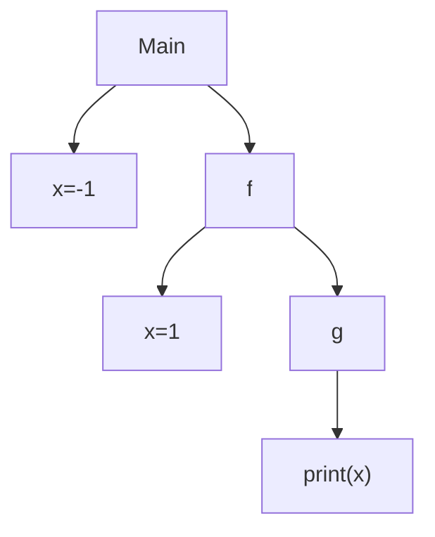
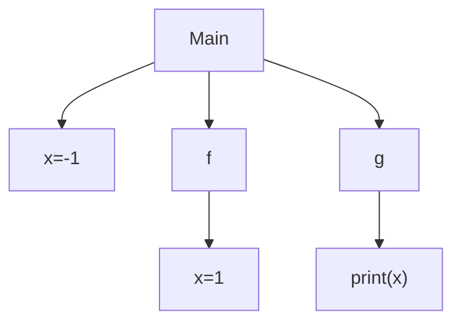
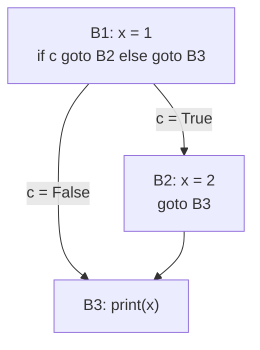
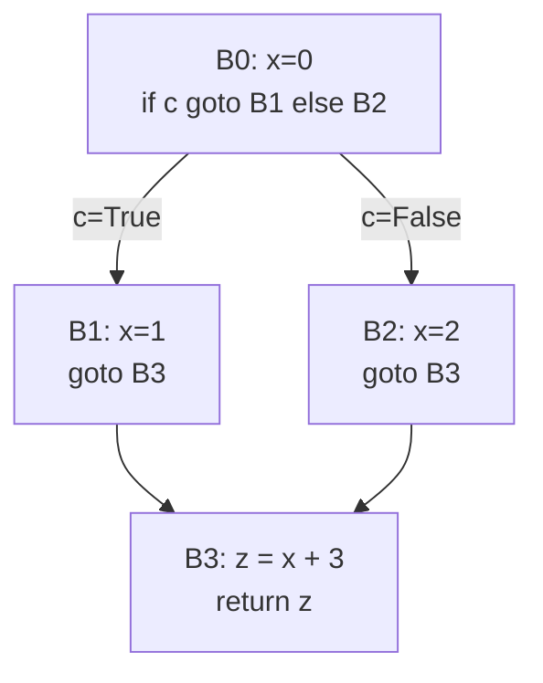
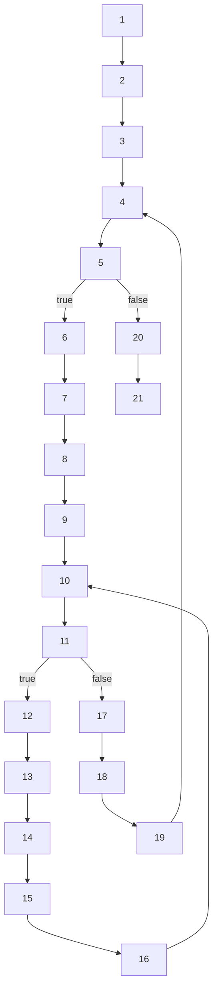
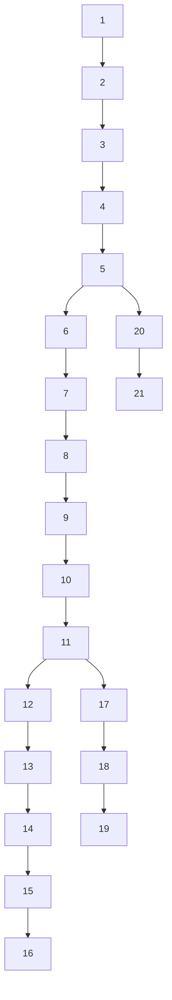

- [Name Analysis (10a)](#name-analysis-10a)
  - [Variable Scope](#variable-scope)
    - [Dynamic Scope](#dynamic-scope)
    - [Static (lexical) Scope](#static-lexical-scope)
  - [SIMP](#simp)
  - [How compilers typically implement name analysis (high-level)](#how-compilers-typically-implement-name-analysis-high-level)
- [Static Single Assignment (10b)](#static-single-assignment-10b)
  - [ϕ (phi) line](#ϕ-phi-line)
    - [General Form](#general-form)
    - [Simple Example](#simple-example)
  - [Constructing Minimal SSA (Cytron)](#constructing-minimal-ssa-cytron)
    - [Cytron’s Algorithm](#cytrons-algorithm)
  - [Constructing a SSA Example](#constructing-a-ssa-example)
    - [Step 1: Build the CFG](#step-1-build-the-cfg)
    - [Step 2: Compute Denominators + idom (needed for Dominance Frontier)](#step-2-compute-denominators--idom-needed-for-dominance-frontier)
    - [Step 3: Compute Dominance Frontier (DF)](#step-3-compute-dominance-frontier-df)
    - [Step 4: Phi (ϕ) Insertion](#step-4-phi-ϕ-insertion)
    - [Step 5: Rename (make each assignment a new version)](#step-5-rename-make-each-assignment-a-new-version)
    - [Final SSA Form](#final-ssa-form)
- [Sign Analysis and Lattice Theory (11a)](#sign-analysis-and-lattice-theory-11a)
  - [Abstract Domain (Sign Lattice)](#abstract-domain-sign-lattice)
- [Code Generation (Stack Machine) (12a)](#code-generation-stack-machine-12a)
  - [Instruction Selection](#instruction-selection)

## Name Analysis (10a)

Given a program, we have many identifiers, and we want to check:

1. Is it a variable name or a function name?
2. Is the variable name of type int or bool?
3. What is the scope of the variable?
4. Has the variable been declared before used?
5. Where is the defined variable used?

_A simple analogy_

Think of your program like a big building, and every variable name is a person’s name.

If someone shouts “Alex!”:

Name analysis figures out **_which Alex_** they meant (nearest relevant one), whether that **Alex exists in this building** section (scope) and whether Alex is **even allowed to respond here** (visibility rules).

---

### Variable Scope

The core idea behind name resolution

A variable's scope is the region of code where that variable name refers to a particular declaration

#### Dynamic Scope

Scope follows the _call stack_ &rarr; when you reference `x`, the language looks for `x` by walking the run-time call chain (who called who)

```python
def f(x) :
  return g(x)
def g(x):
  print(x)

x = 1
f(x)  # 1 is printed
```

Why is 1 printed?

- At runtime, `g` is called inside `f`
- `f` has local `x = 1`
- so `g` sees that `x` through the call chain
- _“Meaning of x depends on the path of calls that got you here.”_

This makes programs harder to reason about, because “what x means” can change depending on runtime behavior.



---

#### Static (lexical) Scope

In static scoping, `x` is resolved based on where `x` is written/declared in the source code, not who called who.

```python

def f():
    x = 1
    return g()
def g():
    print(x)

x = -1
f() # -1 is printed
```

Why is -1 printed? (and not 1)

- `g` is defined at top level
- so `x` inside `g` refers to the top-level `x`, not `f`'s local `x`
- `f`'s `x` has nothing on `g`
- _"Meaning of x depends on the nesting struction of the code"_



---

### SIMP

```mathematica
// SIMP_ERR1
x = 1;
if input == 0 {
  x = 2;
} else {
  y = 1;
}
return y; // y could be undefined.

```

Potential error

- y is only assigned in the else branch.
- If input == 0 is true, we never assign y, but we still return y.
- Only works if input != 0

We don't want to leave things to chance, so we should detect error statically

---

### How compilers typically implement name analysis (high-level)

**Step A**: Build an environment (symbol table)

- As you traverse the program:
- When you see a declaration, add it to the current scope map: x ↦ (kind=var, type=int, declared_at=...)
- When you enter a new scope (block/function), push a new scope frame.
- When you exit, pop it.

**Step B**: Resolve every use

- When you see x used:
- look up x from the innermost scope outward
- if not found: error (used before declared)
- if found: link this use to that definition (this is the “where is the defined variable used?” part)

**Step C**: (Often added) definite-assignment check

- To catch return y safely, you do a lightweight dataflow idea:
- After an if/else, a variable is “definitely assigned” only if it’s assigned on all paths.
- Here, y is assigned only on one path → flag error.

---

## Static Single Assignment (10b)

SSA is an intermediate representation where

- Every variable is assigned exactly once
- If you reassign a variable, you instead create a new version (renaming/alpha renaming)
- When multiple control-flow paths re-define the same original variable, SSA uses a ϕ (phi) assignment to merge those versions at join points

**Core intuition**

SSA turns “variable = a box you keep overwriting” into “variable versions = immutable snapshots” (very FP-like once renaming is included).

---

Example &rarr; Original PA (reassigns `s` and `c`)

```mathematica
// PA1                     // SSA_PA1
1: x <- input              1: x0 <- input
2: s <- 0                  2: s0 <- 0
3: c <- 0                  3: c0 <- 0
4: t <- c < x              4: s1 <- phi(3:s0, 8:s2)
5: ifn t goto 9               c1 <- phi(3:c0, 8:c2)
6: s <- c + s                 t0 <- c1 < x0
7: c <- c + 1              5: ifn t0 goto 9
8: goto 4                  6: s2 <- c1 + s1
9: rret <- s               7: c2 <- c1 + 1
10: ret                    8: goto 4
                           9: rret <- s1
                           10: ret
```

Basically instead of `s` and `c` being overwritten over and over again, we have `s1`, `s2`, ... `s8` and `c1`, `c2`, ... `c8`

For what? So that:

- each use has exactly one definition
- the IR basically is the def-use chain
- Simpler and/or more precise analysis

From the example, return s, which s we talking about? depend on the run, but for the ssa example, we can return s1 directly, or s2 if we want or maybe s6 etc etc

---

### ϕ (phi) line

A ϕ (phi) line is SSA’s way of saying:

“At this control-flow join point, the value of this variable depends on which predecessor block we came from.”

It’s not a normal function call. It’s a _merge_

It picks the right incoming version based on which edge you took to enter the block.

#### General Form

```php
v = phi(P1: a1, P2: a2, ..., Pk: ak)
```

- If execution enters the current block from predecessor P1, then v = a1
- If it enters from P2, then v = a2
- …and so on.

#### Simple Example

```c
if cond:
   x = 2
else:
   x = 3
return x
```

SSA:

- then branch defines `x1 = 2`
- else branch defines `x2 = 3`
- join block:

```kotlin
x3 = phi(then:x1, else: x2)
return x3
```

Meaning:

- if we came from the _then_ block, `x3` becomes `x1`
- if we came from the _else_ block, `x3` becomes `x2`
  So after the join, you can just use `x3` as “the value of `x`”.

---

### Constructing Minimal SSA (Cytron)

#### Cytron’s Algorithm

1. Convert the program to a **\*CFG** (Control Flow Graph).
2. Compute **Dominance Frontiers (DF)** from the CFG.
3. Insert **phi assignments** at DF nodes for variables defined at block `v`.
4. **Rename variables** to ensure each SSA variable is assigned exactly once.

**\*CFG** (Control Flow Graph) is a graph that shows all the possible ways execution can flow through a program.

- **Nodes** = basic blocks (straight-line chunks of code with no jumps in the middle)

- **Edges** = possible jumps/flow from one block to another (like if, while, goto, fall-through)

Example CFG

```c
x = 1
if c:
    x = 2
print(x)
```

Conceptually:
B1: `x=1; if (c) goto B2 else goto B3`
B2: `x=2; goto B3`
B3: `return x`

Edges:
B1 &rarr; B2 (if true)
B1 &rarr; B3 (if false)
B2 &rarr; B3



---

### Constructing a SSA Example

Source Program

```python
x = 0
if c:
    x = 1
else:
    x = 2
z = x + 3
return z
```

#### Step 1: Build the CFG

1. B0 (entry): `x = 0; if c goto B1 else goto B2`
2. B1 (then): `x = 1; goto B3`
3. B2 (else): `x = 2, goto B3`
4. B3 (join): `z = x + 3; return z`



Phi can only happen at joins (needs ≥2 incoming edges).

---

#### Step 2: Compute Denominators + idom (needed for Dominance Frontier)

A block D dominates N if every path from the entry to N must pass through D.
_So dominators tell you what blocks are “always before” other blocks, no matter how the program branches._

B0 dominates B1, B2, B3 because you can’t reach any of them without going through B0.

B1 does not dominate B3 because you can reach B3 via B2 instead.

So the idom (the immediate dominator, i.e. the closes dominator of N) are:

- `dom(B0) = {B0}`
- `dom(B1) = {B0, B1}`
- `dom(B2) = {B0, B2}`
- `dom(B3) = {B0, B3}`

Immediate dominators (closest dominator):
`idom(B1)=B0, idom(B2)=B0, idom(B3)=B0`

---

#### Step 3: Compute Dominance Frontier (DF)

DF(X) = “join points where paths influenced by X meet paths not strictly controlled by X”.

Road analogy: think of X as a neighborhood. DF(X) are the junctions where traffic that came through the neighborhood can meet traffic that avoided it.

Local rule (easy cheat):
For each edge `b -> s`, if `idom(s) != b, then s ∈ DF(b)`.


Apply (do for ALL paths):

- From `B1` -> `B3`: `idom(B3)=B0 != B1` ⇒ `B3 ∈ DF(B1)`

intuitively &uarr; means the intermediate dominator of B3 is B0, not B1, therefore B3 is the first place after B1 where B1's influence stops being exclusive, because other paths can also reach there

- From `B2` -> `B3: idom(B3)=B0 !`= `B2` ⇒ `B3 ∈ DF(B2)`
- From `B0` -> `B1/B2: idom(B1)=B0` and `idom(B2)=B0` ⇒ not in DF

So:

- `DF(B1) = {B3}`
- `DF(B2) = {B3}`
- `DF(B0) = ∅`
- `DF(B3) = ∅`

---

#### Step 4: Phi (ϕ) Insertion

_This is the part where SSA decides exactly which blocks need phi, and for which variables._

```
Recall: General Form
x3 = phi(P1: x1, P2: x2, ..., Pk: xk)
```


Intuitively, at B3:

- if we came from B1, then x should be 1
- if we came from B2, then x should be 2
- So we need to merge the versions of x at the join.
<br>
<hr style="width: 200px; margin-left: 0;" />

1. Find where x is assigned:

- In `B0`: `x=0`
- In `B1`: `x=1`
- In `B2`: `x=2`
- So `DefBlocks(x) = {B0, B1, B2}`
<hr style="width: 200px; margin-left: 0;" />

2. DF to find join points

- DF(B1) = {B3}
- DF(B2) = {B3}
- DF(B0) = ∅
- DF(B3) = ∅
<hr style="width: 200px; margin-left: 0;" />

3. Cytron rule (cheat):

- For each variable x, insert `phi(x)` in every block in `DF⁺(DefBlocks(x))`
  (`DF⁺` = iterated DF; we compute it via a worklist.)

Here:

- `DF(B1)` contains `B3`, `DF(B2)` contains `B3` ⇒ insert `ϕ` for `x` at `B3`.

**_Why phi at B3?_**

- B3 is a join (two predecessors: B1 and B2)
- along different incoming edges, x can be different (1 vs 2)
- SSA needs one name to use after the join → ϕ merges versions

So add at top of B3:

- `x = ϕ(B1: x_from_B1, B2: x_from_B2)`

---

#### Step 5: Rename (make each assignment a new version)

Because `x` is assigned many times, so we rename each definition once:

- In B0: `x0 = 0`
- In B1: `x1 = 1`
- In B2: `x2 = 2`
- In B3 : `x3 = [phi(B1:x1, B2:x2)]`

Then use `x3` after the join:

- `z0 = x3 + 3`
- `return z0`

---

#### Final SSA Form

Final SSA form

Blocks:

- B0: `x0=0`; if `c` goto `B1` else goto `B2`
- B1: `x1=1`; goto `B3`
- B2: `x2=2`; goto `B3`
- B3: `x3=phi(B1:x1, B2:x2)`; `z0=x3+3`; `return z0`

So what have we achieved? Recall the Source Program:

```python
x = 0
if c:
    x = 1
else:
    x = 2
z = x + 3
return z
```

Without SSA, at z = x + 3, the compiler has to figure out:

- does this x come from x=0?
- or from x=1?
- or from x=2?

SSA rewrites it so each assignment makes a new name

```python
B0: x0 = 0
    if c goto B1 else goto B2

B1: x1 = 1
    goto B3

B2: x2 = 2
    goto B3

B3: x3 = phi(B1: x1, B2: x2)
    z0 = x3 + 3
    return z0
```

---

## More CFG Example

#### Example PA

```mathematica
// PA_Ex1
1: x <- input
2: r <- 0
3: i <- 0
4: b <- i < x
5: ifn b goto 20
6: f <- 0
7: s <- 1
8: j <- 0
9: t <- 0
10: b <- j < i
11: ifn b goto 17
12: t <- f
13: f <- s
14: s <- t + f
15: j <- j + 1
16: goto 10
17: r <- r + s
18: i <- i + 1
19: goto 4
20: ret r <- r
21: ret
```

#### CFG



#### Dominant Tree



#### Dominance Frontier Table

Start from LAST NODE

| vertex | successor(s) | children (idom tree) | idom | dflocal | dfup (per child -> contrib) | df (final) |
| ------ | ------------ | -------------------- | ---- | ------- | --------------------------- | ---------- |
| 21     | ∅            | ∅                    | 20   | ∅       | —                           | ∅          |
| 20     | {21}         | {21}                 | 5    | ∅       | 21: ∅                       | ∅          |
| 19     | {4}          | ∅                    | 18   | {4}     | —                           | {4}        |
| 18     | {19}         | {19}                 | 17   | ∅       | 19: {4}                     | {4}        |
| 17     | {18}         | {18}                 | 11   | ∅       | 18: {4}                     | {4}        |
| 16     | {10}         | ∅                    | 15   | {10}    | —                           | {10}       |
| 15     | {16}         | {16}                 | 14   | ∅       | 16: {10}                    | {10}       |
| 14     | {15}         | {15}                 | 13   | ∅       | 15: {10}                    | {10}       |
| 13     | {14}         | {14}                 | 12   | ∅       | 14: {10}                    | {10}       |
| 12     | {13}         | {13}                 | 11   | ∅       | 13: {10}                    | {10}       |
| 11     | {12, 17}     | {12, 17}             | 10   | ∅       | 12: {10}; 17: {4}           | {10, 4}    |
| 10     | {11}         | {11}                 | 9    | ∅       | 11: {4}                     | {4}        |
| 9      | {10}         | {10}                 | 8    | ∅       | 10: {4}                     | {4}        |
| 8      | {9}          | {9}                  | 7    | ∅       | 9: {4}                      | {4}        |
| 7      | {8}          | {8}                  | 6    | ∅       | 8: {4}                      | {4}        |
| 6      | {7}          | {7}                  | 5    | ∅       | 7: {4}                      | {4}        |
| 5      | {6, 20}      | {6, 20}              | 4    | ∅       | 6: {4}; 20: ∅               | {4}        |
| 4      | {5}          | {5}                  | 3    | ∅       | 5: ∅                        | ∅          |
| 3      | {4}          | {4}                  | 2    | ∅       | 4: ∅                        | ∅          |
| 2      | {3}          | {3}                  | 1    | ∅       | 3: ∅                        | ∅          |
| 1      | {2}          | {2}                  | 1    | ∅       | 2: ∅                        | ∅          |

---

- `Successor` &rarr; a node reachable by a direct CFG edge, basically where can it go next literally
  <br>
- `child` &rarr; which nodes are immediately dominated by it **(in the above example, 4 is a successor to 19 BUT not its child, because while 4 is reachable by 19, it is NOT the only way to reach 4)**
  <br>
- `dflocal` &rarr; successor minus(-) children, i.e. whatever successor I have that is NOT dominated by me
  <br>
- `dfup` &rarr; We use the above example at row 18

  To find `dfup` for vertex `18`, we need to calculate `dfup` of `19` which is looking through the list of `df(19)`, which is `4` and MAKE SURE THAT `4` is NOT dominated by `18`, so yes it is not dominated by `18`, so `dfup` for vertex `18` is `4`
  <br>

- `df(v)` = `dfup(All child of v)` UNION `dflocal(v)`

  In the same row 18 example, df(18) would mean dfup ({4}) union dflocal ({}) which gives u 4
