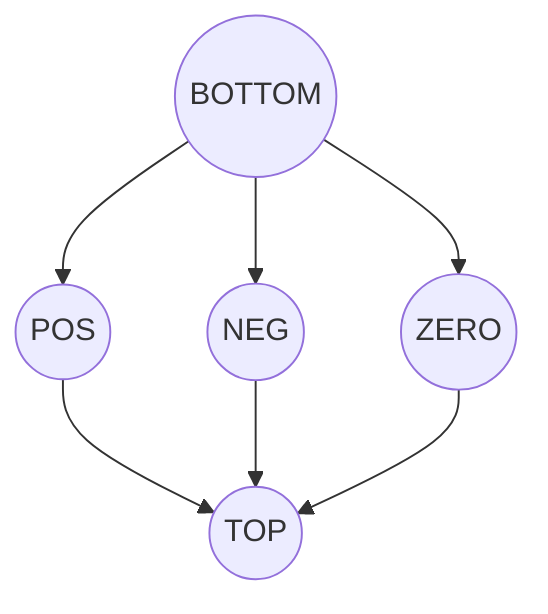
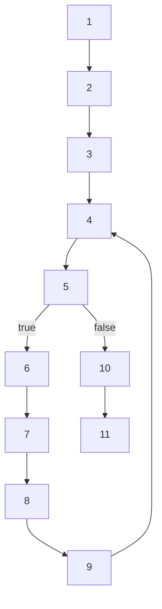

# Week 11A + 11B Lecture Notes: Lattices, Fixed Points, Sign Analysis, and Liveness

These two topics are really the same “big idea” in different outfits:

> **We want to compute a fact about every program point** (after each instruction),
> even with branches/loops, **by solving a system of equations**.
>
> Because branches/loops create circular dependencies, we solve the equations by
> finding a **least fixed point** of a **monotonic function** over a **complete lattice**.

---

## 0) The Big Picture (what are we trying to achieve?)

Compilers (and static analyzers) often need _guaranteed-safe approximations_ of runtime facts:

- **Sign analysis**: “Could `x` be negative here?” (e.g., is `sqrt(x)` safe?)
- **Liveness analysis**: “Will this variable’s current value be used again?”
  (needed for **register allocation** and **dead code elimination**)

Both are examples of **dataflow analysis**:

- pick an _abstract domain_ (a lattice),
- define equations for each program point,
- solve them as a **fixed point**.

---

## 1) Warm-up: Why plain “type inference” isn’t enough (Sign as Type?)

### Example idea

You might think: “let’s refine `int` into `posint/negint/zero` and infer signs like types.”

But the slides point out two killer limitations of type inference in this setting:

1. **Flow-insensitive**: it tries to assign _one_ “type” to a variable for the whole program.
2. **Path-insensitive**: it can’t distinguish different control-flow paths (esp. loops/branches).

So instead, we switch from “types” to **abstract interpretation**:
we compute a _sign fact per program point_, and we merge paths conservatively.

---

## 2) Lattice crash course (the math toolbox)

### 2.1 Partial order (⊑)

Think “is at least as informative as”.

If `a ⊑ b`, read: **a is more precise (or equal precision) than b**.

### 2.2 Join (⊔) and meet (⊓)

- **Join** `x ⊔ y`: least upper bound (LUB) = “merge information conservatively”
- **Meet** `x ⊓ y`: greatest lower bound (GLB) = “common information”

Analogy:

- Join is like combining witness statements: you only keep what’s safe to claim.
- Meet is like taking intersection of guarantees.

### 2.3 Complete lattice

A lattice is **complete** if _every subset_ has a join and meet.
This matters because fixed point theorems rely on it.

### 2.4 Common lattices used in these slides

- **Powerset lattice** `(P(A), ⊆)` ← used for liveness (sets of variables)
- **Product lattice** `L1 × ... × Ln` ← tuple of facts
- **Map lattice** `A → L` ← mapping variables to abstract values (used for sign states)

---

## 3) Sign Analysis (Week 11A)

### 3.1 What is the abstract domain?

We don’t track exact integers, we track **signs**:

- `+` : any positive integer
- `-` : any negative integer
- `0` : exactly zero
- `⊤` : could be +, -, or 0 (unknown / most general)
- `⊥` : no information / impossible / empty (least element)

Interpretation: each abstract value represents a _set_ of concrete values.

### 3.2 The sign lattice

A typical shape:




Key intuition:

- Moving **up** = “less precise, more possible values”
- Moving **down** = “more precise”

### 3.3 Abstract operations (++, --)

To analyze `x = x + 1`, we need an abstract version of `+ 1`.
The slides define tables like:

- `s1(x) ++ +` means “current sign of `x` plus a positive constant”
- similarly `-- +` for subtracting a positive constant

These tables are conservative:
if you can’t be sure, you return `⊤`.

### 3.4 Abstract states

A program state becomes a **map**:

- `State = Var → VarSign`

Example:

- `[x → ⊤, y → 0, t → +]`

This is a **map lattice**: one map is “≤” another if it’s ≤ at every variable.

### 3.5 Turning a program into equations

For each labeled instruction `i`, make a state `s_i`.
Each `s_i` is defined from predecessor states + the instruction’s transfer rule.

- For straight-line code, this is easy: `s2 = transfer(s1)`.

- For branches/loops, you must merge:
  `s_join = join(predecessor states)`
  which is typically a pointwise `⊔` (least upper bound).

### 3.6 Why fixed points appear (loops)

In loops, you get circular equations like:

- `s4` depends on `s9`
- `s9` depends on `s4`

So you can’t “solve once”; you must iterate until stable.

---

## 4) Monotonic functions + Fixed points (Week 11A core engine)

### 4.1 Monotonic function

A function `f` is **monotonic** if:

- whenever `x ⊑ y`, then `f(x) ⊑ f(y)`.

This matters because monotonicity guarantees that iterating from `⊥`
moves “upward” in a controlled way and eventually stabilizes.

### 4.2 Fixed Point Theorem (why iteration works)

For a complete lattice of finite height:

- every monotonic `f` has a **unique least fixed point** `lfp(f)`
- and it can be obtained by iterating from `⊥`:
  `⊥, f(⊥), f(f(⊥)), ...` until no change

### 4.3 Naive fixed point algorithm (intuition)

1. start with the least element (`⊥` / “no info everywhere”)
2. apply `f`
3. repeat until stable

You can think of it as:

> keep propagating facts through the program until nothing new is learned.

### 4.4 How sign analysis fits this pattern

The slides’ “objective” is:

- turn the whole equation system `(s0, s1, ..., sn)` into **one big function**
  `f((s0,...,sn)) = (new_s0,...,new_sn)`
- then compute `lfp(f)` by iteration.

---

## 5) Liveness Analysis (Week 11B)

### 5.1 What does “live” mean?

A variable `v` is **live at program point i** if:

> along **some** path from i to the future, the value currently held in `v`
> might be used before `v` is overwritten.

So liveness is a **may** property: “may be needed”.

### 5.2 Abstract domain = sets of variables

At each point `i`, liveness state is a set:

- `s_i ⊆ V` where `V` is the set of variables

Domain is `P(V)` which forms a **powerset lattice**:

- `⊥ = {}` (no variables live)
- `⊤ = V` (everything live)
- ordering by subset `⊆`

### 5.3 Backward analysis

Unlike sign analysis (forward), liveness is **backward**:

- current liveness depends on what successors will need.

So at point `i`:

- first combine successor facts (join),
- then apply the instruction’s effect.

### 5.4 Join for liveness (may analysis)

Because it’s “may be live”, the join is typically **union**:

- if a variable is live on _either_ successor path, it is live here.

### 5.5 Transfer rules (the core intuition)

For an assignment:

- `t <- expr`
  - `t` becomes **not live** immediately _before_ the assignment (it’s overwritten)
  - variables used in `expr` become **live** (their values are needed)

So conceptually:

- `IN = (OUT - {t}) ∪ uses(expr)`

Other instructions:

- conditional branch uses the condition variable → it becomes live
- return uses the returned variable(s)

---

## 6) Worked Example (from the slides): PA1 liveness

Program (labels 1..11):

```text
1:  x <- input
2:  y <- 0
3:  s <- 0
4:  b <- y < x
5:  ifn b goto 10
6:  y <- y + 1
7:  t <- s
8:  s <- s + y
9:  goto 4
10: rret <- s
11: ret
```

CFG sketch:



The slides construct a single monotonic function `f1` over the tuple
`(s11, s10, ..., s1)` and then apply fixed point iteration.

Final liveness sets shown in the slides (interpretation: “live before that line”):

- `s1 = {input}`
- `s2 = {x}`
- `s3 = {y, x}`
- `s4 = {y, x, s}`
- `s5 = {y, x, s, b}`
- `s6 = {y, x, s}`
- `s7 = {y, x, s}`
- `s8 = {y, x, s}`
- `s9 = {y, x, s}`
- `s10 = {s}`
- `s11 = {}`

Quick sanity checks (how to “feel” the result):

- At `11: ret`, nothing is needed anymore → `{}` ✅
- Just before `10: rret <- s`, we must have `s` available → `{s}` ✅
- Inside the loop (around 4–9), `x`, `y`, `s` keep being needed for comparisons/updates → `{x,y,s}` ✅

---

## 7) Forward vs Backward, May vs Must (Week 11B wrap-up)

### Forward vs backward

- **Sign analysis**: forward (depends on predecessors)
- **Liveness**: backward (depends on successors)

### May vs must (with powerset domains)

- **May analysis**: over-approximation, join with **union (∪)** (liveness)
- **Must analysis**: under-approximation, join with **intersection (∩)**

The slides present **deadness analysis** as the dual of liveness:

- instead of “may be live”, we track “must be dead”
- join becomes meet-like (intersection-style), and the transfer rules flip accordingly.

---

## 8) Takeaway summary

- Pick a lattice that represents the _kind_ of information you want.
  - signs: 5-point sign lattice, states are maps `Var → VarSign`
  - liveness: powerset lattice `P(V)`
- Define transfer equations at each instruction.
- Merges/loops make it recursive.
- Turn the whole system into a monotonic function `f`.
- Compute `lfp(f)` by iterating from the least element until stable.

That’s the core pattern you’ll keep seeing in compiler analyses.
