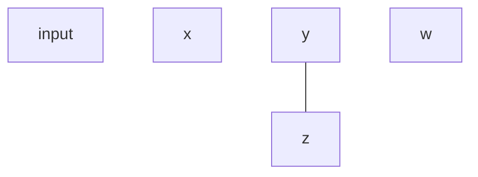
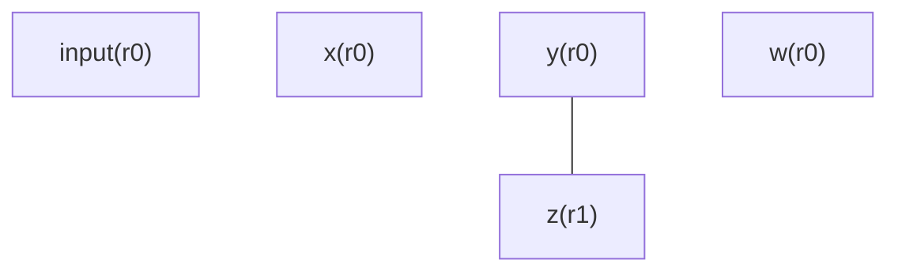

## Code Generation (Stack Machine) (12a)

[back-to-top](#scala)
Recall the compiler pipeline

- `Source Text` &rarr; `[Lexing]` &rarr; `[Parsing]` &rarr; `[Semantic Analysis]` &rarr; `[Optimization]` &rarr; **[Code Generation]**

We are at the last part!

---

### Instruction Selection

1. **1-address instruction**

- Stack machine &rarr; JVM

```
# operands on stack; op pops args, pushes result
# MOST Complex instruction set with stack for computation
# Minimal registers needed, JVM has only 3 registers
# Requires more instructions but less registers

push 1
push 2
add
store r #load it back to variable
```

---

2.  **2-address instruction (CISC) architecture**

- Intel 86
- x86 is a family of rules (an instruction set) that defines how software tells a CPU what to do.

```
# op dst, src   (dst is both input and output)
# more complex instruction set, but fewer registers

load x 1
load y 2
add x y

# r is the same as x
```

---

3. **3-address instruction (RISC) architecture**

- ARM, Pseudo Assembly
- RISC because the number of lines of code have reduced

```
# dst <- src1 op src2
# simple instruction set BUT more registers and tempvar needed

x <- 1
y <- 2
r <- x + y

load x 1
load y 2
add r x y
```

---

### Assembly vs Machine Code

**Assembly** &rarr; human legible
&darr; Assembler + linker &darr;
**Machine** &rarr; binary (not human legible)

---

#### JVM bytecode (1-address)

Goal : SIMP PA → JVM

(JVM Instructions):

- `jis ::= []`
  - Empty instruction sequence.
- `jis ::= ji jis`
  - Sequence of JVM instructions.
    (JVM Instruction):
- `ji ::= ilabel`
  - Label marking a jump target.
- `ji ::= iload n`
  - Load local variable onto stack.
- `ji ::= istore n`
  - Store top stack value into local.
- `ji ::= iadd`
  - Pop two values, push their sum.
- `ji ::= isub`
  - Pop two values, push their difference.
- `ji ::= imul`
  - Pop two values, push their product.
- `ji ::= if_icmpge`
  - Compare two; jump if first ≥ second.
- `ji ::= if_icmpne`
  - Compare two; jump if values unequal.
- `ji ::= goto l`
  - Unconditional jump to label `l`.
- `ji ::= ispush c`
  - Push constant `c` onto stack.
- `ji ::= ireturn`
  - Return integer from the method.
    (JVM local vars):
- `n ::= 1`
- `n ::= 2`
- ...
  - Local variable slot indices.
    (constant):
- `c ::= -32768`
- ...
- `c ::= 0`
- ...
- `c ::= 32767`

  - Signed 16-bit constant range.

- 1: a register for the first operand and result
- 2: a register for the second operand
- 3: a register for controlling the state of the stack operation (we can't use)

---

**An Example (PA → JVM)**

```text
   // PA1                          // JVM (illustrative)
############           ############################################################
1:  x <- input          iload 1        // push the content of input to r0
2:  s <- 0              istore 2       // pop r0's content to x
3:  c <- 0              sipush 0       // push the value 0 to r0
4:  b <- c < x          istore 3       // pop r0 to s
5:  ifn b goto 9        sipush 0       // push the value 0 to r0
6:  s <- c + s          istore 4       // pop r0 to c
7:  c <- c + 1          ilabel 11      // mark label 11
8:  goto 4              iload 4        // push the content of c to r0
9:  rret <- s           iload 2        // push the contetn of x to r1
10: ret                 if_icmpge 12   // if r0 >= r1 jump, pop both r0 r1

                        iload 4        // push the content of c to r0
                        iload3         // push the content of s to r1
                        iadd           // sum up r0 and r1 and result in r0
                        istore 3       // pop r0 to s
                        iload 4        // push the content of c to r0
                        sipush 1       // push a constant 1 to r1
                        iadd
                        istore 4       // pop r0 to c
                        igoto 11
                        ilabel 12
                        iload 3        // push the content of s to r0
                        ireturn
```

PA variables → JVM locals:

- input → 1,
- x → 2,
- s → 3,
- c → 4

PA labels → JVM labels:

- 4 → 11,
- 9 → 12

---

#### Operational Semantics of JVM

We write small-step JVM configurations as:

- `J ⊢ (Δ, S, jis) → (Δ', S', jis')`

where:

- `J` is the JVM program
- `Δ` the local-variable environment &rarr; like JVM's numbered storage slots
  - If Δ(1) = 7, then local slot 1 currently holds 7
- `S` the operand stack
- `jis` (JVM instruction sequence) is the current instruction sequence.

Key small-step rules (informal):

$$
\textbf{(sJLoad1)}\qquad
J \vdash (\Delta,\ \_,\ \_,\ \text{iload } n;\ jis)\ \to\ (\Delta,\ \Delta(n),\ \_,\ jis)
$$

_Meaning:_ Load local `n` onto an empty stack.

$$
\textbf{(sJLoad2)}\qquad
J \vdash (\Delta,\ c,\ \_,\ \text{iload } n;\ jis)\ \to\ (\Delta,\ c,\ \Delta(n),\ jis)
$$

_Meaning:_ Load local `n` onto the second stack slot.

$$
\textbf{(sJPush1)}\qquad
J \vdash (\Delta,\ \_,\ \_,\ \text{sipush } c;\ jis)\ \to\ (\Delta,\ c,\ \_,\ jis)
$$

_Meaning:_ Push constant `c` onto an empty stack.

$$
\textbf{(sJPush2)}\qquad
J \vdash (\Delta,\ c_0,\ \_,\ \text{sipush } c_1;\ jis)\ \to\ (\Delta,\ c_0,\ c_1,\ jis)
$$

_Meaning:_ Push constant `c1` onto the second stack slot.

$$
\textbf{(sJLabel)}\qquad
J \vdash (\Delta,\ r_0,\ r_1,\ \text{ilabel } l;\ jis)\ \to\ (\Delta,\ r_0,\ r_1,\ jis)
$$

_Meaning:_ Labels are markers; they don’t change state.

$$
\textbf{(sJStore)}\qquad
J \vdash (\Delta,\ c,\ \_,\ \text{istore } n;\ jis)\ \to\ (\Delta \oplus (n,c),\ \_,\ \_,\ jis)
$$

_Meaning:_ Pop stack top and store into local slot `n`.

$$
\textbf{(sJAdd)}\qquad
J \vdash (\Delta,\ c_0,\ c_1,\ \text{iadd};\ jis)\ \to\ (\Delta,\ c_0 + c_1,\ \_,\ jis)
$$

_Meaning:_ Pop two integers, push their sum.

$$
\textbf{(sJGoto)}\qquad
J \vdash (\Delta,\ r_0,\ r_1,\ \text{igoto } l';\ jis)\ \to\ (\Delta,\ r_0,\ r_1,\ \text{codeAfterLabel}(J,l'))
$$

_Meaning:_ Jump to the instruction sequence after label `l'`.

$$
\textbf{(sJCmpNE1)}\qquad
\frac{c_0 \ne c_1 \qquad jis' = \text{codeAfterLabel}(J,l')}
     {J \vdash (\Delta,\ c_0,\ c_1,\ \text{if\_icmpne } l';\ jis)\ \to\ (\Delta,\ \_,\ \_,\ jis')}
$$

_Meaning:_ If values differ, jump to label `l'`.

$$
\textbf{(sJCmpNE2)}\qquad
\frac{c_0 = c_1}
     {J \vdash (\Delta,\ c_0,\ c_1,\ \text{if\_icmpne } l';\ jis)\ \to\ (\Delta,\ \_,\ \_,\ jis)}
$$

_Meaning:_ If values equal, continue to the next instruction.

---

$$
\textbf{codeAfterLabel}(\text{ireturn},\ l)\ =\ \text{error}
$$

_Meaning:_ Error if label wasn’t found before return.

$$
\textbf{codeAfterLabel}(\text{ilabel } l';\ jis,\ l)\ =\
\begin{cases}
jis & \text{if } l = l' \\
\text{codeAfterLabel}(jis,\ l) & \text{otherwise}
\end{cases}
$$

_Meaning:_ If label matches, return remaining code; else keep searching.

$$
\textbf{codeAfterLabel}(ji;\ jis,\ l)\ =\ \text{codeAfterLabel}(jis,\ l)
$$

_Meaning:_ Skip non-label instruction and continue searching for the label.

Notes:

- `codeAfterLabel(J, l)` denotes the instruction sequence of `J` starting at label `l`.
- These rules are the standard small-step behaviour used in the lecture slides.

---

### From PA to JVM

M - a mapping from PA tempvar to JVM local var

L - a mapping from PA labels (which are used as the targets in some jump instructions) to JVM labels

**3 rules**

```text
M, L ⊢ jis_PA ⇒ jis_JVM
  -- Translate PA instruction sequence `jis_PA` to JVM `jis_JVM` using mappings.

M, L ⊢ S_PA ⇒ jis_JVM
  -- Translate PA operand-stack `S_PA` into JVM pushes/instructions.

L ⊢ l_PA ⇒ jis_JVM
  -- Translate PA label `l_PA` into the JVM label and its code.
```

---

#### Example (PA &rarr; JVM)

```mathematica
1:  x <- 7
2:  t <- x < 10
3:  ifn t goto 6
4:  y <- x + 1
5:  goto 7
6:  y <- x - 1
7:  rret <- y
8:  ret
```

_t is a boolean temp in PA (result of comparison)._

_ifn t goto 6 means “if NOT t, jump to label 6”._

##### 1) Pick the mappings M and L

Variable-to-local mapping M

- `M(x) = 1`
- `M(y) = 1`

Label mapping L

- Only labels that are jump targets need JVM labels

Jump targets in PA:

- line 6 (target of goto 6)
- line 7 (target of goto 7)

So:

- L(6) = L6
- L(7) = L7

##### 2) Translate PA &rarr; JVM

The below will document the step by step translation, with justification at each step which operation semantics is being used and why as well as the updates to local variable and S

PA program:

```text
1:  x <- 7
2:  t <- x < 5
3:  ifn t goto 6
4:  y <- x + 2
5:  goto 7
6:  y <- x - 2
7:  rret <- y
8:  ret
```

Mappings:

- `M(x)=1`, `M(y)=2`
- `L(6)=L6`, `L(7)=L7`

JVM program J:

```text
sipush 7
istore 1

iload 1
sipush 5
if_icmpge L6

iload 1
sipush 2
iadd
istore 2
igoto L7

ilabel L6
iload 1
sipush 2
isub
istore 2

ilabel L7
iload 2
ireturn
```

State notation:

- `Δ` = locals map (e.g., `Δ(1)=x`, `Δ(2)=y`)
- `S` ∈ { `(_,_)`, `(c,_)`, `(c0,c1)` } (same as slide)
- I’ll show `Before → After` for `Δ` and `S` each step.

---

##### Run A (x = 7): takes the ELSE path (jumps to L6)

Initial:

- Δ = {1:?, 2:?}
- S = (_, _)

**PA Line 1: `x <- 7` (emits `sipush 7; istore 1`)**

1. `sipush 7`

- Rule: **(sJPush1)**
- Why this rule: stack is empty `(_,_)`, so push goes into first slot.
- Δ: {1:?, 2:?} → {1:?, 2:?}
- S: (_,_) → (7,\_)

2. `istore 1`

- Rule: **(sJStore)**
- Why this rule: `istore` requires a value on stack top `(c,_)` to store.
- Δ: {1:?, 2:?} → {1:7, 2:?}
- S: (7,_) → (_,\_)

---

**PA Lines 2–3: `t <- x < 5; ifn t goto 6`**

(Compiled as “push x, push 5, then branch if x >= 5”.)

3. `iload 1`

- Rule: **(sJLoad1)**
- Why this rule: stack is empty `(_,_)`, so load fills first slot.
- Δ: {1:7, 2:?} → {1:7, 2:?}
- S: (_,_) → (Δ(1),_) = (7,_)

4. `sipush 5`

- Rule: **(sJPush2)**
- Why this rule: stack has one value `(7,_)`, so push fills second slot.
- Δ: {1:7, 2:?} → {1:7, 2:?}
- S: (7,\_) → (7,5)

5. `if_icmpge L6`

- Rule used: **same conditional-branch pattern as (sJCmpNE1)/(sJCmpNE2)**, but with predicate `>=`
- Why this “jump case”: operands are `(7,5)` and `7 >= 5` is true → jump.
- Δ: {1:7, 2:?} → {1:7, 2:?}
- S: (7,5) → (_,_)
- Control effect: next `jis` becomes `codeAfterLabel(J, L6)` (jump to ELSE block).

---

**PA Line 6: `y <- x - 2` (label + arithmetic + store)**

6. `ilabel L6`

- Rule: **(sJLabel)**
- Why this rule: labels are markers; they don’t change Δ or S.
- Δ: {1:7, 2:?} → {1:7, 2:?}
- S: (_,_) → (_,_)

7. `iload 1`

- Rule: **(sJLoad1)**
- Why this rule: stack is empty `(_,_)`.
- Δ: {1:7, 2:?} → {1:7, 2:?}
- S: (_,_) → (7,\_)

8. `sipush 2`

- Rule: **(sJPush2)**
- Why this rule: stack has one value `(7,_)`.
- Δ: {1:7, 2:?} → {1:7, 2:?}
- S: (7,\_) → (7,2)

9. `isub`

- Rule used: **same stack-shape as (sJAdd)**, but compute `c0 - c1`
- Why this rule shape: `isub` consumes two stack values `(c0,c1)` and leaves one result.
- Δ: {1:7, 2:?} → {1:7, 2:?}
- S: (7,2) → (7-2,_) = (5,_)

10. `istore 2`

- Rule: **(sJStore)**
- Why this rule: `istore` pops `(c,_)` and writes into local slot 2.
- Δ: {1:7, 2:?} → {1:7, 2:5}
- S: (5,_) → (_,\_)

---

**PA Lines 7–8: `rret <- y; ret` (load then return)**

11. `ilabel L7`

- Rule: **(sJLabel)**
- Why this rule: labels don’t change machine state.
- Δ: {1:7, 2:5} → {1:7, 2:5}
- S: (_,_) → (_,_)

12. `iload 2`

- Rule: **(sJLoad1)**
- Why this rule: stack is empty `(_,_)`.
- Δ: {1:7, 2:5} → {1:7, 2:5}
- S: (_,_) → (5,\_)

13. `ireturn`

- Rule: (not shown on your screenshot page)
- What happens: program halts and returns the top stack value (here `5`).
- Δ: unchanged
- S: consumed by return (conceptually returns `5` and stops)

Result of Run A: returns **5**.

---

##### Run B (x = 3): takes the THEN path (falls through, uses `igoto L7`)

This run exists so you can see Line 4 and Line 5 execute with their rules.

Change only PA Line 1 to: `x <- 3` (so `3 >= 5` is false).

Initial:

- Δ = {1:?, 2:?}
- S = (_, _)

**PA Line 1: `x <- 3`**

1. `sipush 3`

- Rule: **(sJPush1)** (stack empty)
- Δ: {1:?, 2:?} → {1:?, 2:?}
- S: (_,_) → (3,\_)

2. `istore 1`

- Rule: **(sJStore)**
- Δ: {1:?, 2:?} → {1:3, 2:?}
- S: (3,_) → (_,\_)

**PA Lines 2–3: compare + branch**

3. `iload 1`

- Rule: **(sJLoad1)** (stack empty)
- Δ: {1:3, 2:?} → {1:3, 2:?}
- S: (_,_) → (3,\_)

4. `sipush 5`

- Rule: **(sJPush2)** (one item already)
- Δ: {1:3, 2:?} → {1:3, 2:?}
- S: (3,\_) → (3,5)

5. `if_icmpge L6`

- Rule used: **same conditional-branch pattern as (sJCmpNE1)/(sJCmpNE2)**, but with `>=`
- Why this “fall-through case”: `3 >= 5` is false → do NOT jump.
- Δ: {1:3, 2:?} → {1:3, 2:?}
- S: (3,5) → (_,_)
- Control effect: continue with the next instruction (THEN block).

**PA Line 4: `y <- x + 2`**

6. `iload 1`

- Rule: **(sJLoad1)** (stack empty)
- Δ: {1:3, 2:?} → {1:3, 2:?}
- S: (_,_) → (3,\_)

7. `sipush 2`

- Rule: **(sJPush2)** (one item already)
- Δ: {1:3, 2:?} → {1:3, 2:?}
- S: (3,\_) → (3,2)

8. `iadd`

- Rule: **(sJAdd)**
- Why this rule: `iadd` requires two operands `(c0,c1)` and produces `(c0+c1,_)`.
- Δ: {1:3, 2:?} → {1:3, 2:?}
- S: (3,2) → (5,\_)

9. `istore 2`

- Rule: **(sJStore)**
- Δ: {1:3, 2:?} → {1:3, 2:5}
- S: (5,_) → (_,\_)

**PA Line 5: `goto 7`**

10. `igoto L7`

- Rule: **(sJGoto)**
- Why this rule: unconditional jump replaces `jis` with `codeAfterLabel(J, L7)`.
- Δ: {1:3, 2:5} → {1:3, 2:5}
- S: (_,_) → (_,_)
- Control effect: skip ELSE block; jump to code after `ilabel L7`.

**PA Lines 7–8: return**

11. `iload 2`

- Rule: **(sJLoad1)** (stack empty)
- Δ: {1:3, 2:5} → {1:3, 2:5}
- S: (_,_) → (5,\_)

12. `ireturn`

- Rule: (not shown on your screenshot page)
- What happens: halt and return top stack value `5`.

Result of Run B: returns **5**.

---

##### Quick “why rule X vs rule Y” summary

- Use **(sJPush1)** when `S = (_ , _)`; use **(sJPush2)** when `S = (c , _)`.
- Use **(sJLoad1)** when `S = (_ , _)`; use **(sJLoad2)** when `S = (c , _)`.
- Use **(sJStore)** when `S = (c , _)` (needs one value to store).
- Use **(sJAdd)** when `S = (c0 , c1)` (needs two values).
- Use **(sJGoto)** for `igoto l'` to jump via `codeAfterLabel(J, l')`.
- Use **(sJLabel)** for `ilabel l` (no state change).
- Conditional `if_icmpge` follows the **same jump/fall-through structure** as **(sJCmpNE1)/(sJCmpNE2)**.

---

## Register Allocation Problem (12b)

PA is already a 3-address code

- Unlimited registers
- Unlimited tempVar
- Operation can be applied to both registers and tempVar

But in reality,

- Limited registers
- Large set of tempVar but never unlimtied
- Most operation only work on registers

Problem:

Given program `p`, allocate variables/results to `k` registers such that:

- behavior stays the same
- spilling is minimized

So its an optimisation problem

### Interference Graph

A data structure to reason able the constraints of register allocation

2 tempvar are interferring when they are both "live" at the same time in the program

##### Goal (why we build this graph)

We want to **allocate a small number of registers** to many temporaries.
Two temporaries **cannot share the same register** if they are **live at the same time**.
The **interference graph** encodes exactly those “cannot-share” constraints.

---

The PA program (PA1) + liveness info shown on the slide

```text
// PA1
1:  x    <- input      // {input}
2:  y    <- x + 1      // {x}
3:  z    <- y + 1      // {y}
4:  w    <- y * z      // {y, z}
5:  rret <- w          // {w}
6:  ret               // {}
```

Interpretation of the `{ ... }` on each line:

- It shows which temporaries are **live at that program point** (their values will be needed later).
- If **two names appear together** in the same set, they **overlap in time** → they **interfere**.

---

##### 2) Build the interference graph from liveness

##### Rule (what edges mean)

- Make one node per temporary: `input, x, y, z, w`.
- Add an **undirected edge** between `A` and `B` if there exists **any point** where both are live together.

##### Apply the rule to PA1

Look at the sets:

- Line 1: `{input}` → no pair → no edge
- Line 2: `{x}` → no pair → no edge
- Line 3: `{y}` → no pair → no edge
- Line 4: `{y, z}` → **pair exists** → add edge **`y — z`**
- Line 5: `{w}` → no pair → no edge

So the only interference constraint here is:

- **`y` interferes with `z`**

That’s exactly the single edge drawn on the slide.

---

##### 3) The interference graph (Mermaid)



---

##### 4) Use the graph to assign registers (graph coloring idea)

##### What register allocation is doing here

Think of each register as a “color”.

- If two nodes are connected by an edge, they must have **different colors**.
- If two nodes are **not** connected, they _may_ share a color/register (as long as no other overlap forces separation).

##### Apply to this graph

Only `y` and `z` are adjacent, so:

- `y` must be in a different register from `z`
- everyone else can reuse either register since they don’t overlap with a conflict

One valid assignment (matching the slide’s idea):

- `z → r1`
- `y → r0`
- `input, x, w → r0` (they don’t interfere with `y` or `z` in a conflicting way)

---

##### 5) Interference graph + one concrete register assignment (Mermaid)



---

### Chordal Graphs 

#### 1) Why these show up in register allocation

- **Liveness** tells you which variables’ _current values still matter_ at each point.
- If two variables are live at the same time, they **interfere** → they cannot share the same register.
- Build an **interference graph**:
  - Vertex = variable
  - Edge (u, v) = u and v are live at the same time
- If that interference graph is **chordal**, we can color it (allocate registers) efficiently.

---

#### 2) Chordal graph (definition + intuition)

#### Definition

A graph is **chordal** if **every cycle of length > 3 has a chord**.

- A **chord** is an extra edge connecting two non-adjacent vertices in the cycle.

#### Intuition

- A 4-cycle is “dangerous” unless it has a diagonal.
- Chordal graphs have a “tree-like” elimination structure, which makes coloring easy.

#### Tiny picture (cycle vs chordal)

```mermaid
graph LR
  subgraph Chordless 4-cycle (NOT chordal)
    a---b---c---d---a
  end
```
```
graph LR
  subgraph 4-cycle + a chord (Chordal)
    a---b---c---d---a
    b---d
  end
```

### Liveness Table (Live-Range Table)

_What it means_

A liveness table marks, for each variable, the program points where it is _live_ &rarr; **Liveness** tells you which variables’ _current values still matter_ at each point.
- If two variables are live at the same time, they **interfere** → they cannot share the same register.
- Build an **interference graph**:
  - Vertex = variable
  - Edge (u, v) = u and v are live at the same time
- If that interference graph is **chordal**, we can color it (allocate registers) efficiently.

Think of it like a timeline: “this value must be kept until its last use”.

This table is often more convenient than drawing the full interference graph for allocation.

```mathematica
1. a1 <- 0  
2. b1 <- 1  
3. c1 <- a1 + b1  
4. d1 <- b1 + c1  
5. a2 <- c1 + d1  
6. e1 <- 2  
7. d2 <- a2 + e1  
8. r_ret <- e1 + d2  
9. ret
```

#### Step A: Live-in sets (what must be available *before* each line)
- LiveIn(9) = {}
- LiveIn(8) = {e1, d2}
- LiveIn(7) = {a2, e1}
- LiveIn(6) = {a2}
- LiveIn(5) = {c1, d1}
- LiveIn(4) = {b1, c1}
- LiveIn(3) = {a1, b1}
- LiveIn(2) = {a1}
- LiveIn(1) = {}

(Interpretation: “these values are still needed from here onward.”)

#### Step B: Live-range (liveness) table
Rule of thumb in straight-line SSA:
- A variable is live from just after its definition **until its last use**.

| var | 1 | 2 | 3 | 4 | 5 | 6 | 7 | 8 | 9 |
|-----|---|---|---|---|---|---|---|---|---|
| a1  |   | * | * |   |   |   |   |   |   |
| b1  |   |   | * | * |   |   |   |   |   |
| c1  |   |   |   | * | * |   |   |   |   |
| d1  |   |   |   |   | * |   |   |   |   |
| a2  |   |   |   |   |   | * | * |   |   |
| e1  |   |   |   |   |   |   | * | * |   |
| d2  |   |   |   |   |   |   |   | * |   |

How to read a column:
- Column `i` shows which variables are simultaneously live around instruction `i`.
- Those variables must be in **different registers** (unless you spill to memory).

#### Step C: Interference graph edges from the table
Connect variables that overlap in a column (or appear together in a LiveIn set):
- From LiveIn(3) = {a1, b1} ⇒ edge (a1, b1)
- From LiveIn(4) = {b1, c1} ⇒ edge (b1, c1)
- From LiveIn(5) = {c1, d1} ⇒ edge (c1, d1)
- From LiveIn(7) = {a2, e1} ⇒ edge (a2, e1)
- From LiveIn(8) = {e1, d2} ⇒ edge (e1, d2)

So the interference graph is basically two chains:
- a1 — b1 — c1 — d1
- a2 — e1 — d2

This graph is chordal (in fact it’s a forest, and forests are always chordal).
